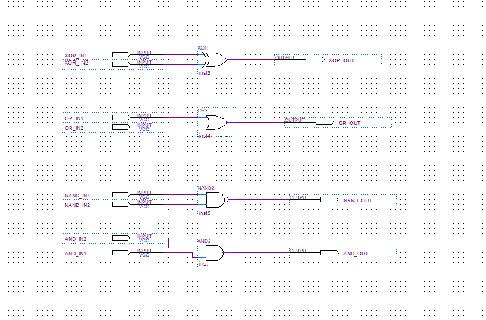
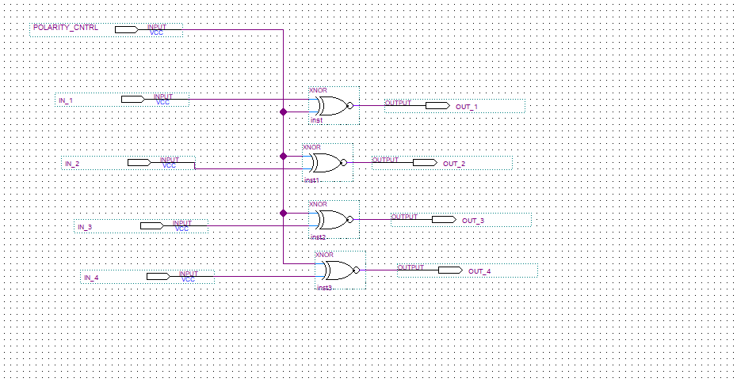

## Lab 1 Design Entry Methods: Schematic & Verilog

### What I Built
A gate-level logic circuit implementing XOR, OR, NAND, and AND functions, entered in two ways: schematic and Verilog, and verified through functional simulation before being flashed onto the FPGA.

*Figure 1: Schematic entry of the four gate-level functions (XOR, OR, NAND, AND).*

### What I Learned

**FPGA Architecture**
Understood how FPGAs differ from microprocessors at a fundamental level. An FPGA's logic is defined by configuration memory cells that control lookup tables (LUTs) and interconnects. A download file reconfigures the hardware itself, not just the software running on fixed hardware. This distinction shaped how I think about hardware design as a discipline separate from software.

**Two Design Entry Methods**
Worked with both schematic-based block diagram entry and Verilog HDL entry to implement the same gate functions. Seeing the same logic expressed in two completely different ways one visual, one textual, made it clear why HDL is the industry standard: it scales, schematics don't.

**Functional Simulation**
Before touching the hardware, I used Quartus Prime's simulation waveform tool to apply stimulus signals and verify gate truth tables visually. This was my first real introduction to the test-before-deploy discipline: catch logic errors in simulation, not after you've programmed the chip.

**Active-High vs Active-Low Signals**
The push-button inputs on the LogicalStep board are active-low, meaning a pressed button reads as logic 0. I had to insert inverters between the physical pins and the logic block to convert the signal polarity. This was a practical lesson that hardware signals don't always match the logical convention you design around, and that interface awareness is part of hardware engineering.

**Signal Polarity Control**
Extended the design with a polarity control block that lets a switch flip all output active states between active-high and active-low with a single input. This reinforced how XOR gates can be used as programmable inverters, a pattern that appears constantly in real digital design.

*Figure 2: Polarity control block — a shared `POLARITY_CNTRL` signal feeds four XNOR gates, letting one switch invert all four outputs.*

**Key Takeaway**
Simulation is not optional; it's the workflow. Design, synthesize, simulate, verify against truth tables, then program. Skipping simulation means debugging in hardware, which is significantly harder.

## Tools & Environment

| Tool | Purpose |
|---|---|
| Intel Quartus Prime v18.1 | Synthesis, simulation, compilation, FPGA programming |
| University of Waterloo LogicalStep Board | Altera MAX10 FPGA development platform |
| Verilog HDL | Hardware description language for all designs |
| Quartus Waveform Simulator (VWF) | Functional simulation and verification |
| USB Blaster (JTAG) | Programming interface to the FPGA |
